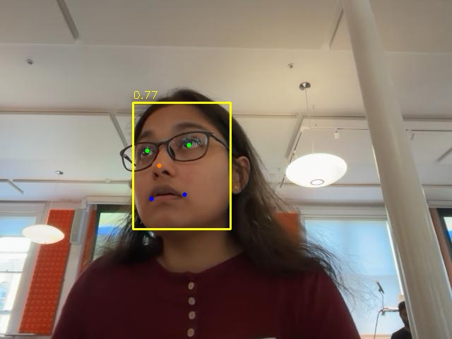

# Landmark Detection & Face Alignment Pipeline

Standalone pipeline that takes raw photos, detects faces using RetinaFace, localises 5 facial landmarks, and produces geometrically aligned 112×112 crops ready for a face recognition model.

---

## Pipeline

```
Raw photo
    ↓
RetinaFace (MobileNet) — face bounding box + 5 landmarks
    ↓
Similarity transform (cv2.warpAffine) — rotate + scale + translate
    ↓
112×112 aligned crop — ready for ArcFace recognition
```

---

## The 5 Landmarks

| Point | Colour in visualisation |
|---|---|
| Left eye | Green |
| Right eye | Green |
| Nose tip | Orange |
| Left mouth corner | Blue |
| Right mouth corner | Blue |

---

## Results

### Detection + Landmark Localisation



RetinaFace detects the face bounding box (yellow) and places all 5 landmarks in the correct positions. Confidence score shown top-left of the bounding box.

### Aligned 112×112 Crop


Output of the similarity transform — face centred, upright, eyes at fixed pixel positions. This is the format expected by the ArcFace recognition backbone.

### Alignment: before vs after

| | Before | After |
|---|---|---|
| Resolution | Any | 112 × 112 px |
| Face position | Anywhere in frame | Centred |
| Rotation | Any | Upright |
| Scale | Any | Fixed — eyes always ~35px apart |
| Input to recognition | ❌ | ✅ |

### Target landmark positions (112×112 space)

| Point | x | y |
|---|---|---|
| Left eye | 38.3 | 51.7 |
| Right eye | 73.5 | 51.5 |
| Nose tip | 56.0 | 71.7 |
| Left mouth | 41.5 | 92.4 |
| Right mouth | 70.7 | 92.2 |

These fixed targets are the InsightFace standard — the same coordinates used when creating CASIA-WebFace, so alignment is consistent end-to-end with the recognition training data.

---

## Model

**RetinaFace** with MobileNet backbone (`buffalo_sc` from InsightFace).

| Property | Value |
|---|---|
| Model | RetinaFace MobileNet |
| Input size | 640 × 640 (detector) |
| Output | Bounding box + 5 landmarks per face |
| Model size | ~1.6 MB |
| Faces per image | Multiple supported |
| Framework | ONNX via insightface |

RetinaFace was chosen because it performs face detection and landmark localisation in a single forward pass — no separate detector + landmark model needed. It is also the same model used to produce the alignment in CASIA-WebFace, ensuring consistency with the downstream recognition pipeline.

---

## Edge Deployment Model (`landmark_model.h5`)

For running landmark regression on the **EdgeSphere GPX-10** NPU, `build_landmark_model.py` builds a compact PFLD-style regressor that predicts 98 landmarks (196 coords) from an aligned 112×112 crop. It is verified compatible with the [GPX-10 compatibility checker](https://edgesphere.netlify.app/).

| Property | Value |
|---|---|
| Model type | **Sequential** Keras (GPX-10 rejects Functional/subclassed) |
| Layers | Conv2D · BatchNormalization · ReLU · Flatten · Dense |
| Input | 112 × 112 × 3 |
| Output | 196 (98 landmarks × 2) |
| Parameters | **150,580** (< 200k budget) |
| Toolchain | TensorFlow / Keras **2.15.0**, full `.h5` export |
| GPX-10 verdict | **Compatible ✅** — 0 unsupported layers/operators |

Build it with:

```bash
python build_landmark_model.py --out landmark_model.h5
```

> **Note:** `build_landmark_model.py` produces an **untrained** (random-init) model — it is architecture-only, for verifying GPX-10 compatibility. Train it before deployment.

### Training on WFLW

`train_landmark.py` trains the 98-point regressor on [WFLW](https://wywu.github.io/projects/LAB/WFLW.html) (PFLD-style pre-cropped 112×112 format; a ready mirror is `duongnguy/WFLW_augmented` on Hugging Face) using **Wing loss**, and reports **NME** (Normalised Mean Error, inter-ocular — the standard WFLW protocol):

```bash
python train_landmark.py --wflw_root /path/to/wflw --epochs 40 --out landmark_model.h5
python evaluate.py       --wflw_root /path/to/wflw --model landmark_model.h5
```

**Measured accuracy** (74,950 train / 2,500 test images, 40 epochs, CPU):

| Metric | Value |
|---|---|
| NME (inter-ocular) | **21.77% mean / 16.34% median** |
| Mean per-point error | 10.36 px (median 7.68 px) on the 112×112 crop |
| Failure Rate @0.10 | 74.8% |
| PCK@0.10 / @0.15 / @0.20 | 33.4% / 50.5% / 62.4% |
| Mean-shape baseline (reference) | 50.1% NME |

> **This is a weak baseline, not a production model.** It clearly learns (2.3× better than the mean-shape baseline) but sits well above landmark SOTA (~4% NME) and even typical compact models (~7–8%). The gap is expected: a 150k-param **direct-coordinate** regressor, trained briefly on CPU with photometric-only augmentation, on a hard dataset (WFLW is ~45% hard faces). Biggest levers to improve, in order: **geometric augmentation** (rotation/scale/translation/flip with landmark remapping), longer training with a cosine LR schedule, and heatmap-style output instead of coordinate regression (heavier, but the standard route to sub-8% NME). Note that heatmap heads use ops (e.g. transposed conv / resize) that may not be GPX-10-compatible — re-run the checker after any such change.

**GPX-10 design constraints** (why this differs from the RetinaFace/PFLD reference architectures — see `COMPILER_COMPATIBILITY.md`): the checker accepts **Sequential models only**, has **no global-pooling layer**, and no merge layers (`Add`/`Concatenate`), depthwise/separable convs, or upsampling. Every block is a plain `Conv → BN → ReLU` chain, so the whole graph maps onto the supported op set. The 7×7 feature map is `Flatten`ed straight into the FC head (rather than global-average-pooled to 1×1) so spatial position is preserved for landmark regression.

---

## Geometric Alignment

The alignment is a **similarity transform** — rotation, scale, and translation only. No warping or perspective distortion.

Given detected landmarks `src` and fixed target positions `dst`, OpenCV solves for the 4-parameter transform (angle, scale, tx, ty) using least squares:

```python
transform, _ = cv2.estimateAffinePartial2D(src, dst, method=cv2.RANSAC)
aligned = cv2.warpAffine(image, transform, (112, 112))
```

This ensures every face crop has:
- Eyes at the same height and horizontal distance
- Face at a consistent scale
- No tilt

---

## Usage

```bash
pip install insightface onnxruntime opencv-python-headless
```

**Single image:**
```bash
python detect_and_align.py --input photo.jpg --output_dir ./crops
```

**Directory of images:**
```bash
python detect_and_align.py --input ./photos/ --output_dir ./crops
```

**Visualise detections (bounding box + landmarks):**
```bash
python detect_and_align.py --input photo.jpg --output_dir ./crops --visualise
```

Output crops are named: `<original_stem>_face<N>_score<confidence>.jpg`

---

## Output Format

Each detected face is saved as a 112×112 RGB JPEG — the exact format expected by the [face recognition pipeline](https://github.com/sneha-cornell/face_recognition).

```python
# Feed directly into ArcFace backbone
import tensorflow as tf
img = tf.image.decode_jpeg(tf.io.read_file("crop.jpg"), channels=3)
img = (tf.cast(img, tf.float32) - 127.5) / 128.0   # normalise to [-1, 1]
embedding = backbone(img[None], training=False)      # (1, 128)
```

---

## Training Dataset: WIDER FACE

RetinaFace was trained on **WIDER FACE**, a large-scale face detection benchmark scraped from the web across 61 event categories (parade, protest, concert, sports, etc.).

### Scale

| Stat | Value |
|---|---|
| Total images | 32,203 |
| Total annotated faces | 393,703 |
| Training split | 12,880 images |
| Validation split | 3,226 images |
| Test split | 16,097 images |

### Annotations

Each face in the training set has:
- **Bounding box** — (x, y, width, height) in pixel coordinates
- **5-point landmarks** — added by the RetinaFace authors on top of WIDER FACE for the ~13,000 training images (left eye, right eye, nose tip, left mouth corner, right mouth corner)
- **Difficulty flag** — Easy / Medium / Hard based on scale, occlusion, and pose

The landmark annotations are not part of the original WIDER FACE release — they were added specifically for RetinaFace training and are distributed separately by the InsightFace team.

### Difficulty split

WIDER FACE deliberately includes hard conditions to build a robust detector:

| Difficulty | Criteria | % of faces |
|---|---|---|
| Easy | Large faces, frontal, minimal occlusion | ~22% |
| Medium | Moderate scale, some occlusion or pose | ~33% |
| Hard | Small faces (<10px), heavy occlusion, extreme pose | ~45% |

45% of faces fall in the Hard category — this is why RetinaFace generalises well to real-world conditions like the partially occluded, slightly off-angle face in the example above.

### Image conditions

| Condition | Range in dataset |
|---|---|
| Faces per image | 1 – 160+ |
| Face scale | 10px to full-image |
| Pose | Frontal, profile, upside-down |
| Occlusion | None to heavy (sunglasses, masks, hands) |
| Lighting | Indoor, outdoor, night, flash |
| Image source | Web photos across 61 event categories |

### Why this matters for alignment quality

The wide distribution of poses and scales in WIDER FACE means RetinaFace is robust to the kinds of faces you encounter in real deployments — not just clean frontal studio shots. The landmark predictions remain accurate even at moderate pose angles, which directly affects the quality of the similarity transform and the resulting 112×112 crop fed to the recognition model.

---

## Alternative Face Datasets

WIDER FACE is a **detection** benchmark (5-point landmarks only). For training or fine-tuning the dense landmark regressor (`landmark_model.h5`, 98 points) or the downstream recognition backbone, other datasets are a better fit. Comparison of commonly-used options:

### Landmark / alignment datasets

| Dataset | Faces / Images | Landmarks | Pose & conditions | Notes |
|---|---|---|---|---|
| **WFLW** | 10,000 images | **98** | Large pose, occlusion, blur, make-up, expression, illumination attributes | Same 98-point scheme as this model — the most direct training source. Per-image attribute labels enable hard-case analysis |
| **300W** | ~4,000 images | **68** | Indoor/outdoor, in-the-wild | The de-facto 68-point benchmark; unifies LFPW, AFW, HELEN, iBUG |
| **300W-LP** | ~60,000 (synthesised) | 68 | Large-pose profiles synthesised via 3DMM | Great for pose robustness; pairs with the AFLW2000-3D test set |
| **AFLW** | ~25,000 faces | 21 | Wide yaw range (±120°), real-world | Large, multi-view; sparser landmark scheme |
| **COFW** | 1,852 images | 29 | Heavy occlusion focus | Small; a stress test for occlusion robustness |
| **HELEN** | 2,330 images | 194 (dense) | High-resolution | Very dense contours; good for fine boundary detail |

### Detection datasets (for the RetinaFace stage)

| Dataset | Faces / Images | Landmarks | Notes |
|---|---|---|---|
| **WIDER FACE** | 393,703 faces / 32,203 img | 5 (added by InsightFace) | Current detector training set; hard-case coverage |
| **FDDB** | 5,171 faces / 2,845 img | none | Classic detection eval; ellipse annotations |
| **MAFA** | 35,806 masked faces | none | Masked/occluded-face detection |

### Recognition datasets (for the downstream ArcFace backbone)

| Dataset | Identities | Images | Notes |
|---|---|---|---|
| **CASIA-WebFace** | 10,575 | ~494K | Aligned with the same 5-point scheme used here — matches this pipeline end-to-end |
| **VGGFace2** | 9,131 | ~3.31M | Large pose/age variation; strong for backbone pre-training |
| **MS1M-ArcFace** | ~85K | ~5.8M | Cleaned MS-Celeb-1M; standard large-scale ArcFace training set |
| **LFW** | 5,749 | 13,233 | Verification benchmark, not for training |

**Recommendation:** for `landmark_model.h5`, train on **WFLW** (native 98-point labels) and optionally augment with **300W-LP** for large-pose robustness; evaluate NME on the WFLW test split. Keep **CASIA-WebFace** for the recognition backbone so alignment targets stay consistent across the pipeline.

---

## References

- Deng et al., [RetinaFace: Single-Shot Multi-Level Face Localisation in the Wild](https://arxiv.org/abs/1905.00641), CVPR 2020
- InsightFace: [github.com/deepinsight/insightface](https://github.com/deepinsight/insightface)
- Related: [face_recognition](https://github.com/sneha-cornell/face_recognition) — ArcFace backbone trained on CASIA-WebFace
